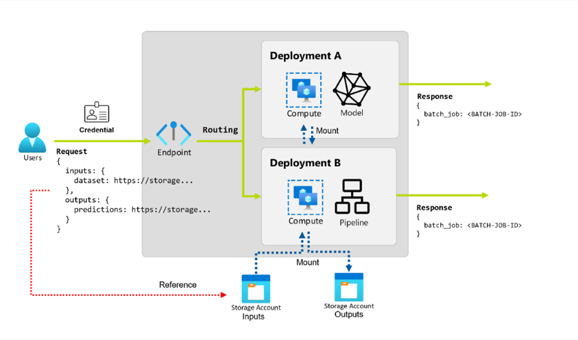
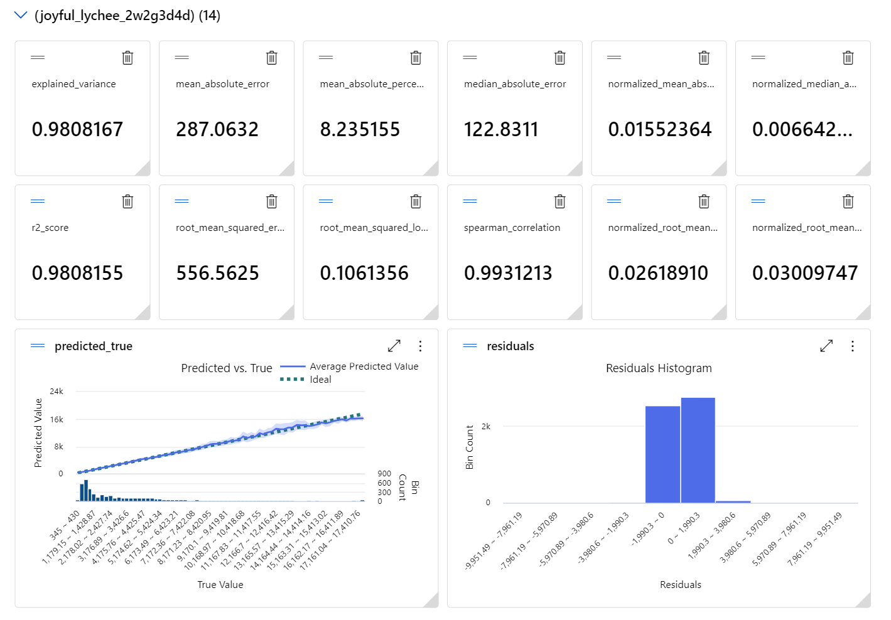

# Azure ML – Deploy and Integrate an ML model using Batch Endpoints 

#### TL:DR  
>This repo includes an example on how to deploy and integrate the usage of an ml model with .Net. Probably the most cost effective cloud deployment strategy for your ml model! Hosted by Azure, serverless, and invokable by rest! Best part, swapping a model is as easy as swapping a URL!  

   

#### Deploy Technology | Azure ML Batch Endpoint    
Batch endpoints in Azure Machine Learning Workspace lets you process large datasets efficiently by running predictions in the background. It streamlines your workflow by automating and scheduling tasks, so you can sit back, relax, and maybe even grab a coffee while the magic happens.

<figure>
  
  <figcaption>Figure 1: An illustration of information flow using Batch Endpoints (<a href="https://learn.microsoft.com/en-us/azure/machine-learning/concept-endpoints-batch?view=azureml-api-2">source</a>).</figcaption>
</figure>

Microsoft doc; [What are batch endpoints? - Azure Machine Learning | Microsoft Learn](https://learn.microsoft.com/en-us/azure/machine-learning/concept-endpoints-batch?view=azureml-api-2). BUT, as you will see later, it is somewhat lacking and **incorrect**!! (07.2024)

   
   
   

---

## Repository example case: Dimond Pricing Estimation
I recently got engaged 🎉, and read a lot about the 4Cs of 💍. So, here is a diamond dataset from [Kaggle](https://www.kaggle.com/datasets/joebeachcapital/diamonds?resource=download). The data includes the 4Cs and some other parameters, including price. Let’s test Azure Batch Endpoint on estimating diamond prices based on the 4Cs.

#### Model training 
The process of splitting the data and training a model is not the focus point in this article, but the general gist is as follows:
1.	Splitt your data in 2 or 3 parts, train-test or train-validation-test.
2.	Use preferred ML approach. I think the “Auto ML” approach (insert data, get black box out) is pretty straight forward, in my case I will use the service from Azure, similar services are available elsewhere too. Steps include:
	a.	Load data to Azure 
	b.	Configure their auto ml service
	c.	Initiate the model training
	d.	Evaluate model performance
	e.	Use model  

<figure>
  
  <figcaption>Figure 2: The results on the test(enseen) set not doing any data enhancing, using the "insert data, get black box out" approach.</figcaption>
</figure>

(If there is interest in the above part, maybe I will add an in-depth section for it.) 

 
 

---

### Deploy and Integrate

**Steps in Azure Machine Learning Workspace | Deploy & Hosting**
1. Register your model in Azure Machine Learning Workspace. (Does not matter if you trained it there or you have your own custom model, you can register it in the model registry either way.)
2. Use the toolbar in your model view, and select **Deploy->Batch endpoint**. 
3. That’s "it". Now you can start using your model.

**Steps in .Net | Integration & Usage**  
1. Configure access control to Azure resources
2. Code level authentication - Azure Storage account access
3. Code level authentication - Azure Machine Learning Workspace / Batch Endpoint access.
4. Code uploading data
5. Code Invoking batch endpoint
6. Code monitoring the model prediction status 
7. Code extracting the prediction results

