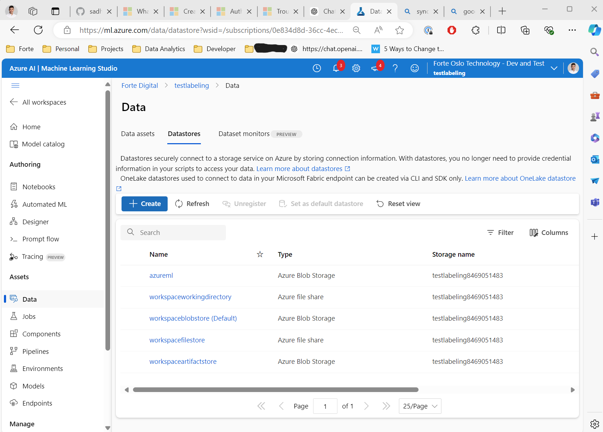
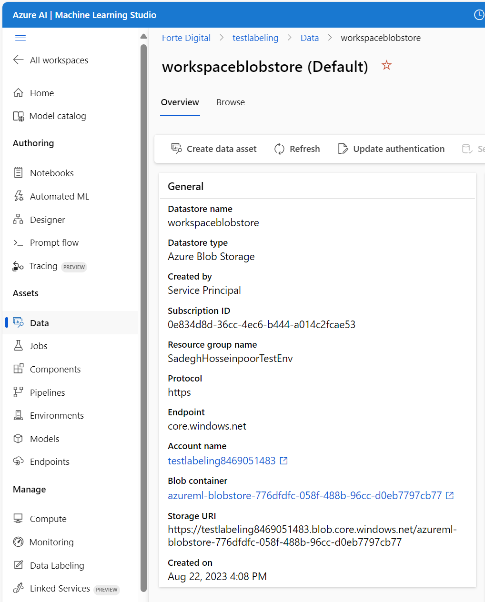
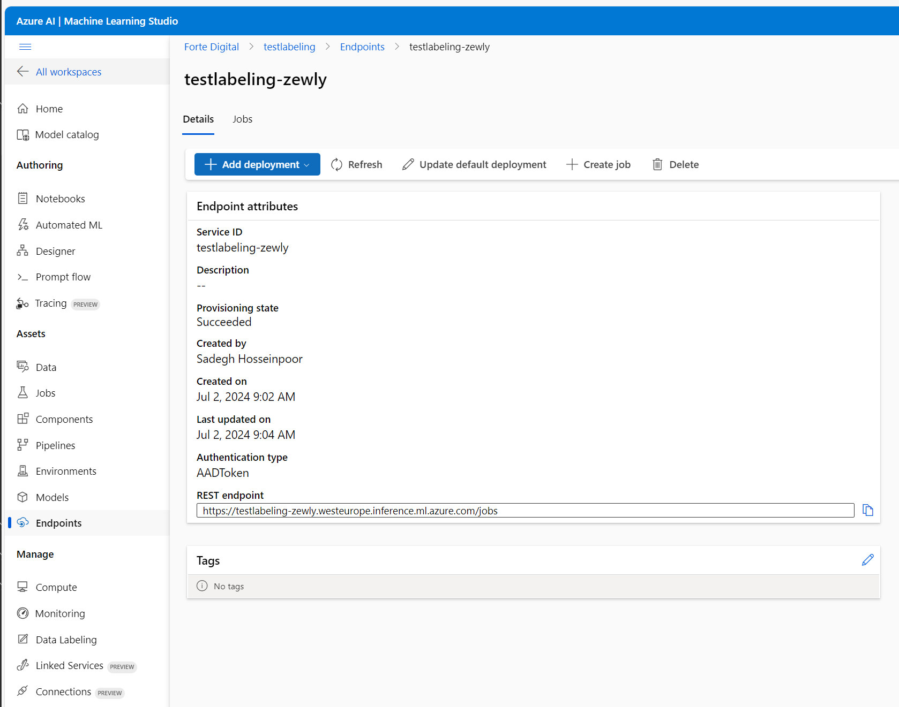

# Azure ML – Deploy and Integrate an ML model using Batch Endpoints 

#### TL:DR  
>This repo includes an example on how to deploy and integrate the usage of an ml model using .Net. Probably the most cost effective cloud deployment strategy for your ml model! Hosted by Azure, serverless, and invokable by rest! Best part, swapping a model is as easy as swapping a URL!  

<br> 

#### Service temporarily available for testing
If you want to test this service with the below example case (Diamond apraisal) you can navigate to this "site": [Swagger | dAImond ](https://daimond-e0agegaxajezd9bx.norwayeast-01.azurewebsites.net/swagger/index.html).  
Here you can use the API to aprais diamonds based on its 4Cs. Service available for now. 


#### Deploy Technology | Azure ML Batch Endpoint    
Batch endpoints in Azure Machine Learning Workspace lets you process large datasets efficiently by running predictions in the background. It streamlines your workflow by automating and scheduling tasks, so you can sit back, relax, and maybe even grab a coffee while the magic happens.  

Microsoft doc; [What are batch endpoints? - Azure Machine Learning | Microsoft Learn](https://learn.microsoft.com/en-us/azure/machine-learning/concept-endpoints-batch?view=azureml-api-2). BUT, as you will see later, it is somewhat lacking and **incorrect**!! (07.2024)

<figure>
  
  <figcaption style="text-align: center;">Figure 1: An illustration of information flow using Batch Endpoints (<a href="https://learn.microsoft.com/en-us/azure/machine-learning/concept-endpoints-batch?view=azureml-api-2">source</a>).</figcaption>
</figure>

<br> 

#### Information flow explanation
Batch Endpoint allows you to run model inferencing on a schedule. This is facilitated (approach detailed below) by allowing the user to save data in a csv file at a location available over the network. 
Then the user can reference this file when invoking a rest(batch) endpoint, and detail what location the resulting output should be saved. 
The rest endpoint will access the data, process it and save the output either at a default location or where the user has requested the output to be saved.

<br>  

---

## Example Case for Context (Expandable content)
<details>

<summary>Repository example case: Diamond Pricing Estimation</summary>

### Repository example case: Diamond Pricing Estimation
I recently got engaged 🎉, and read a lot about the 4Cs of 💍. So, here is a diamond dataset from [Joebeachcapital | Kaggle](https://www.kaggle.com/datasets/joebeachcapital/diamonds?resource=download). The data includes the 4Cs and some other parameters, including price. Let’s test Azure Batch Endpoint on estimating diamond prices based on the 4Cs.

#### Model training 
The process of splitting the data and training a model is not the focus point in this article, but the general gist is as follows:
1.	Splitt your data in 2 or 3 parts, train-test or train-validation-test.
2.	Use preferred ML approach. I think the “Auto ML” approach (insert data, get black box out) is pretty straight forward, in my case I will use the service from Azure, similar services are available elsewhere too. Steps include:
	a.	Load data to Azure 
	b.	Configure their auto ml service
	c.	Initiate the model training
	d.	Evaluate model performance
	e.	Model ready to use

<figure>
  
  <figcaption style="text-align: center;">Figure 2: The results on the test(unseen) set not doing any data enhancing, using the "insert data, get black box out" approach. One might argue there is not more performance to gain.</figcaption>
</figure>

</details>

<br>

---

## Deploy and Integrate

### Steps in Azure Machine Learning Workspace | Model Deploy & Hosting
<details>

<summary>Model Deploy & Hosting</summary>

<br>

1. Register your model in Azure Machine Learning Workspace. (Does not matter if you trained it there or you have your own custom model, you can register it in the model registry either way.)
2. Use the toolbar in your model view, and select **Deploy->Batch endpoint**. 
3. Provide environment and scoring script. When using Azure ML Workspace, this is handled for you. 
4. That’s "it". Now your model is ready to serve.

https://github.com/sadhoss/AzureBatchEndpoint/assets/16901477/a949b5e6-c5c2-4834-b604-590c5eb368d4

</details>


### Steps in .Net | Integration & Usage

<details>

<summary>Integration & Usage</summary>

#### 1. Authorization required to invoke batch endpoints | Azure resources
[How authorization works | Microsoft Learn](https://learn.microsoft.com/en-us/azure/machine-learning/how-to-authenticate-batch-endpoint?view=azureml-api-2&tabs=rest#how-authorization-works) 
> To invoke a batch endpoint, the user must present a valid Microsoft Entra token representing a security principal. This principal can be a user principal or a service principal. In any case, once an endpoint is invoked, a batch deployment job is created under the identity associated with the token. The identity needs the following permissions in order to successfully create a job:  
✅ Read batch endpoints/deployments.  
✅ Create jobs in batch inference endpoints/deployment.  
✅ Create experiments/runs.  
✅ Read and write from/to data stores.  
✅ Lists datastore secrets.  

In simple terms you have to have the contributor role on the Azure ML workspace resource to invoke the batch endpoint.

---
#### 2. Authorization on data source | Batch Endpoint | Azure resources

**Azure Machine Learning Workspace | Access**  
When the batch endpoint is invoked you have to reference the data you want to perform inferencing on. 
I am not sure of the limitations of batch endpoint, where it can access data from and where it cannot. 
However, as it is the Azure ML workspace (AMLW) resource that will access the files, the AMLW needs to be granted read rights. 
**If you wish to avoid struggling with the access control for this**, you can use the container stores within the azure storage 
account associated with the AMLW.    
It is important to note the AMLW configures access to the container store with its own constraints (as datastores).
Hence, if you wish to ensure the default authorization is enough, data that the batch endpoint is used on needs to be uploaded within the configured AMLW datastores.  

<br>

Finding the location where you need to upload your data can be done this way; 
- From within the AML workspace, find, on the left side menu, the Data page. 
- From within the Data page, navigate to the datastore pane 
- Select a datastore
- Here you are presented with the blob container and the azure storage account.

<figure style="text-align: center;">
  
  <figcaption style="text-align: center;">Figure 3: Overview of datastores associated with the Azure ML Workspace.</figcaption>
</figure>

<figure style="text-align: center;">
  
  <figcaption style="text-align: center;">Figure 4: Datastore details.</figcaption>
</figure>

<br>
<br>

**System Requesting to Upload Data | Access**   
Now, to the system that would write data to the Azure Storage account the Batch Enpoint would get data from to run inferencing.  


I assumed it would be sufficient with the *contributor* role for the Azure Storage Account to write data, but no.. 
When trying to upload data through code, at least with the nuget package Azure.Storage.Blobs, you are required to have the **Storage blob data contributor** rights as well. 

---

#### 3. Code level authentication - Azure Storage account | Azure ML Workspace / Batch Endpoint | Access.
We can get an authorization token during runtime by using the Azure.Identity nuget package. 
We only need to reference the tenantId where the resources are provisioned and the user access is defined, the rest is automated by the library, with its [DefaultAzureCredential](https://learn.microsoft.com/en-us/dotnet/api/overview/azure/identity-readme?view=azure-dotnet#defaultazurecredential) tool.
This tool loops through several locations where the credential info might be located. The simplest approach to configure the authorization in dev env would be to use the Azure CLI in combination with DefaultAzureCredential:
```
6. Azure CLI - If the developer has authenticated an account via the Azure CLI az login command, 
the DefaultAzureCredential will authenticate with that account.
```

---
#### 4. Code uploading data & downloading the prediction data

In order to perform prediction on some data we have, we need to upload it somewhere the service has access. 
When uploading the data to an Azure Storage Account, the simplest approach is using the *Azure.Storage.Blobs* nuget package. 
authorizing the client with the above method, enables easy uploading of data.  

When the Batch Endpoint has been invoked and finished running on the data, you can configure it to save the data in the same location.  
Allowing for simple downloading of files with the same nuget package. 

---
#### 5. Code Invoking batch endpoint

The batch endpoint as mentioned is invoked by a REST endpoint. 
The invocation consists of three parts:
1. Ah HttpClient with configured with correct access. 
   > This is done as explained above for the storage account access.
2. The endpoint URL required to activate the batch endpoint.
   > This can be found in the overview page of the endpoint: <figure>
	  
	  <figcaption style="text-align: center;">Figure 5: Endpoint Overview.</figcaption>
	</figure>
3. The endpoint body, with metadata on where data can be found and optionally where to save the prediction. It is possible to configure the body with several storage options, but as we decided using the datastore option, I will cover this here.   
   > The microsoft doc got some errors on this: Microsoft doc; [Input data from data stores - Batch Endpoints | Microsoft Learn](https://learn.microsoft.com/en-us/azure/machine-learning/how-to-access-data-batch-endpoints-jobs?view=azureml-api-2&tabs=rest#input-data-from-data-stores) (07.2024).   
   > We need to update the uri-template in the template for the batch endpoint to work.

**MS Doc | Incorrect Template**
```
{
    "properties": {  
        "InputData": {  
            "heart_dataset": {
                "JobInputType" : "UriFolder",
                "Uri": "azureml:/subscriptions/<subscription>/resourceGroups/<resource-group/providers/Microsoft.MachineLearningServices/workspaces/<workspace>/datastores/<data-store>/paths/<data-path>"
            }
        }
    }
}
```

**Correct Template**
```
{
    "properties": {  
        "InputData": {  
            "heart_dataset": {
                "JobInputType" : "UriFolder",
                "Uri": "azureml://subscriptions/<subscription>/resourcegroups/<resource-group>/workspaces/<workspace>/datastores/<data-store>/paths/<data-path>"
            }
        }
    }
}
```

In the output template you can configure the prediction file name as well. Below, code snippet from repo code, filename: AzureMLBatchClient.cs. 

```
// Prepare the request body
var requestBody = new
{
    properties = new
    {
        InputData = new
        {
            DiamondPricing = new
            {
                JobInputType = "UriFile",
                Uri = uriFilepath + ".csv"
            }
        },
        OutputData = new
        {
            score = new
            {
                JobOutputType = "UriFile",
                Uri = uriFilepath + "_predictions.csv"
            }
        }
    }
};
```


---
#### 6. Code monitoring the model prediction status 

A batch job is preferable when running predictions is done asynchronously and in large quantity. This allows for variable wait time for server booting and job running. 
The challenge introduced through such an implementation is that there is no confirmation when the job is finished, either failed or completed. 
Hence, in order to get an overview of the job progress we need to query for it regularly.   

This can be done by using the same batchEndpoint URI and include the jobId returned when invoking the endpoint.
``` 
var statusUrl = _azureMLBatchClientOptions.EndpointUri + $"/{jobId}";

var statusBody = await statusResponse.Content.ReadAsStringAsync();
var statusJsonResponse = JsonSerializer.Deserialize<JsonElement>(statusBody);
var jobStatus = statusJsonResponse.GetProperty("properties").GetProperty("status").GetString();
```

</details>
